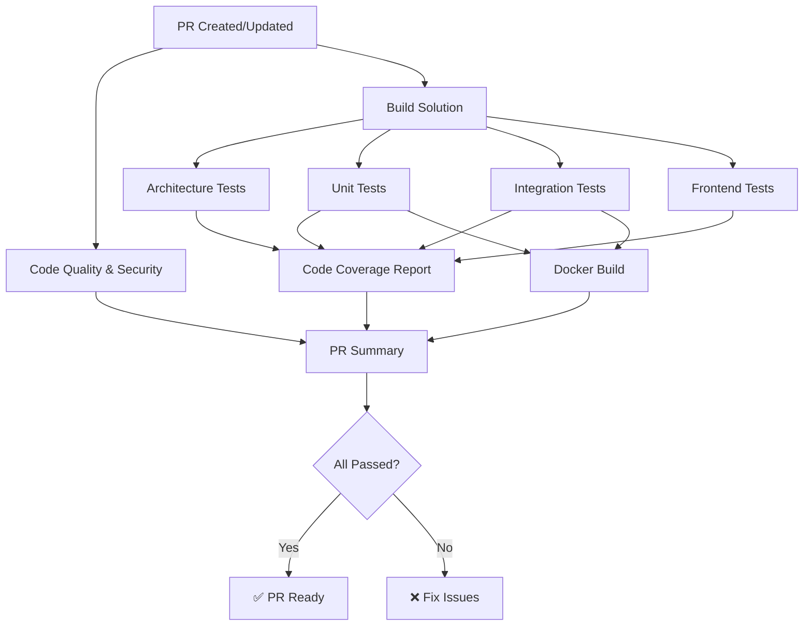

# GitHub Actions CI/CD Pipelines

This directory contains GitHub Actions workflows for the Nexus project.

## 📋 Pull Request Pipeline (`pr.yml`)

The PR pipeline is a comprehensive CI workflow that runs on every pull request to `main` or `develop` branches.

### Pipeline Overview



### Jobs Breakdown

#### 1. **Code Quality** (~2-3 minutes)
- **Purpose**: Ensures code formatting standards
- **Checks**:
  - `dotnet format` verification (no formatting changes needed)
- **Note**: Security scanning (CodeQL) runs in a separate workflow

#### 2. **Build Solution** (~3-5 minutes)
- **Purpose**: Validates code compiles successfully
- **Matrix Strategy**: Builds in both Debug and Release configurations
- **Features**:
  - NuGet package caching for faster builds
  - Node.js setup for Blazor frontend
  - Artifact upload (Release builds only)
- **Outputs**: Build artifacts for downstream jobs

#### 3. **Architecture Tests** (~2-3 minutes)
- **Purpose**: Validates architectural boundaries and conventions
- **Tests**:
  - Layer dependency rules (Domain → Application → Infrastructure)
  - Naming conventions
  - Project references validation
- **Depends On**: Build job
- **Coverage**: Code coverage collected

#### 4. **Unit Tests** (~3-5 minutes)
- **Purpose**: Fast, isolated tests for business logic
- **Test Projects**:
  - `Nexus.Domain.UnitTests` - Domain entities, value objects, events
  - `Nexus.Application.UnitTests` - Commands, queries, handlers
- **Depends On**: Build job
- **Coverage**: Code coverage collected with OpenCover format
- **Output**: TRX test reports + coverage files

#### 5. **Integration Tests** (~5-10 minutes)
- **Purpose**: Tests with real external dependencies
- **Services**:
  - PostgreSQL 17 (with health checks)
  - Redis 7 (with health checks)
- **Test Projects**:
  - `Nexus.Api.IntegrationTests` - API endpoint tests
  - `Nexus.ImageProcessor.IntegrationTests` - Image processing tests
  - `Nexus.Migrations.IntegrationTests` - Database migration tests
- **Depends On**: Build job
- **Coverage**: Code coverage collected
- **Environment**: Isolated test database per run

#### 6. **Frontend Tests** (~2-4 minutes)
- **Purpose**: Tests Blazor frontend components
- **Test Projects**:
  - `Nexus.Frontend.UnitTests` - Component tests
- **Dependencies**: .NET + Node.js
- **Coverage**: Code coverage collected

#### 7. **Code Coverage Report** (~2-3 minutes)
- **Purpose**: Aggregates and reports test coverage
- **Features**:
  - Uses ReportGenerator for multiple formats
  - Generates HTML, Cobertura, and Markdown reports
  - Posts coverage summary to PR as a comment
  - Adds coverage to job summary
  - Maintains coverage history
- **Depends On**: All test jobs
- **Always Runs**: Even if some tests fail (to see what coverage was achieved)

#### 8. **Docker Build** (~5-8 minutes)
- **Purpose**: Validates Docker images build successfully
- **Matrix Strategy**: Builds multiple services
  - `Nexus.Api`
  - `Nexus.ImageProcessor`
- **Features**:
  - Uses BuildKit for better caching
  - GitHub Actions cache integration
  - Does NOT push images (PR validation only)
- **Depends On**: Unit and integration tests

#### 9. **PR Check Summary** (~1 minute)
- **Purpose**: Aggregates all job results
- **Features**:
  - Creates summary table of all jobs
  - Fails if any required job failed
  - Posts summary to job output
- **Depends On**: All jobs
- **Always Runs**: To provide status even on failures

### Pipeline Features

#### 🚀 Performance Optimizations
- **Parallel Execution**: Independent jobs run in parallel
- **Caching**: NuGet packages and Docker layers cached
- **Matrix Builds**: Multiple configurations in parallel
- **Selective Artifact Upload**: Only Release builds uploaded

#### 🔒 Security
- **Separate CodeQL Workflow**: Runs automatically on push, PRs, and weekly schedule
- **Dependency Scanning**: Via Dependabot
- **Multi-language Analysis**: C# and JavaScript
- **SARIF Upload**: Results viewable in Security tab

#### 📊 Reporting
- **Test Results**: TRX files uploaded as artifacts
- **Coverage Reports**: HTML and Cobertura formats
- **PR Comments**: Coverage summary posted automatically
- **Job Summaries**: Markdown summaries in job output

#### 🐳 Docker
- **Multi-service Build**: Validates all Docker images
- **Cache Optimization**: BuildKit with GitHub Actions cache
- **No Push**: Images built but not pushed (PR validation)

### Environment Variables

```yaml
DOTNET_VERSION: '10.0.x'               # .NET SDK version
DOTNET_SKIP_FIRST_TIME_EXPERIENCE: true # Skip .NET telemetry
DOTNET_CLI_TELEMETRY_OPTOUT: true      # Disable telemetry
NODE_VERSION: '22.x'                    # Node.js for Blazor
```

### Required Secrets

None required for PR pipeline (uses default `GITHUB_TOKEN`).

### Optional Enhancements

Consider adding these in the future:

1. **Mutation Testing**: Add Stryker.NET for mutation testing
2. **Performance Tests**: Add benchmark tests with BenchmarkDotNet
3. **E2E Tests**: Add Playwright tests for full user flows
4. **Dependency Review**: Add `dependency-review-action`
5. **Label Automation**: Auto-label PRs based on changed files
6. **Size Limits**: Check binary size increases
7. **Breaking Change Detection**: Check for API breaking changes
8. **Renovate/Dependabot**: Automated dependency updates

### Troubleshooting

#### Build Failures
```bash
# Locally test the build
dotnet build Nexus.slnx --configuration Release
```

#### Format Check Failures
```bash
# Fix formatting issues locally
dotnet format Nexus.slnx
```

#### Test Failures
```bash
# Run specific test project
dotnet test Nexus.Domain.UnitTests/Nexus.Domain.UnitTests.csproj -v detailed

# Run with coverage
dotnet test --collect:"XPlat Code Coverage"
```

#### Docker Build Failures
```bash
# Build Docker image locally
docker build -f Nexus.Api/Dockerfile -t nexus-api:local .
```

### Estimated Pipeline Duration

| Scenario | Duration |
|----------|----------|
| Best case (cached, all pass) | ~6-10 minutes |
| Worst case (no cache, failures) | ~12-18 minutes |
| Average | ~8-12 minutes |

**Note**: CodeQL security analysis runs in a separate workflow (adds ~5-8 minutes)

### Success Criteria

For a PR to pass:
- ✅ Code formatting must be correct
- ✅ No security vulnerabilities found
- ✅ All builds succeed (Debug + Release)
- ✅ All architecture tests pass
- ✅ All unit tests pass
- ✅ All integration tests pass
- ✅ All frontend tests pass
- ✅ Docker images build successfully
- ✅ Code coverage collected (no minimum threshold enforced)

### Viewing Results

1. **Test Results**: Download artifacts from workflow run
2. **Coverage Report**: View in PR comment or download artifact
3. **Security Issues**: Check Security → Code scanning alerts
4. **Job Summaries**: Expand job details in Actions tab

## 🔄 Future Workflows

Consider adding these workflows:

- `ci.yml` - Main branch CI (deploy to staging)
- `cd.yml` - Production deployment
- `release.yml` - Create releases and tags
- `dependabot.yml` - Automated dependency updates (✅ Already configured)
- `stale.yml` - Close stale issues/PRs

## 🔒 CodeQL Security Analysis (`codeql.yml`)

Automated security scanning that runs independently from PR checks.

### Triggers
- **Push**: Runs on `main` and `develop` branches
- **Pull Requests**: Runs on PRs to `main` and `develop`
- **Manual**: Can be triggered via workflow_dispatch

### Languages Analyzed
- **C#**: All .NET projects
- **JavaScript/TypeScript**: Blazor frontend code

### Features
- Matrix strategy for multi-language analysis
- Custom configuration via `.github/codeql/codeql-config.yml`
- Focuses on production code (excludes test projects)
- Results uploaded to GitHub Security tab
- Runs security-extended and security-and-quality queries

### Configuration
The workflow uses a custom CodeQL configuration that:
- Excludes test projects from certain checks
- Focuses on production code paths
- Runs comprehensive security queries

### Viewing Results
1. Go to the **Security** tab in GitHub
2. Click **Code scanning alerts**
3. View detected vulnerabilities and recommendations

### Duration
- C# analysis: ~5-8 minutes
- JavaScript analysis: ~2-3 minutes
- Total: ~7-11 minutes (runs in parallel)

## 📚 Resources

- [GitHub Actions Documentation](https://docs.github.com/en/actions)
- [.NET GitHub Actions](https://github.com/actions/setup-dotnet)
- [CodeQL for C#](https://codeql.github.com/docs/codeql-language-guides/codeql-for-csharp/)
- [Docker Build Push Action](https://github.com/docker/build-push-action)

